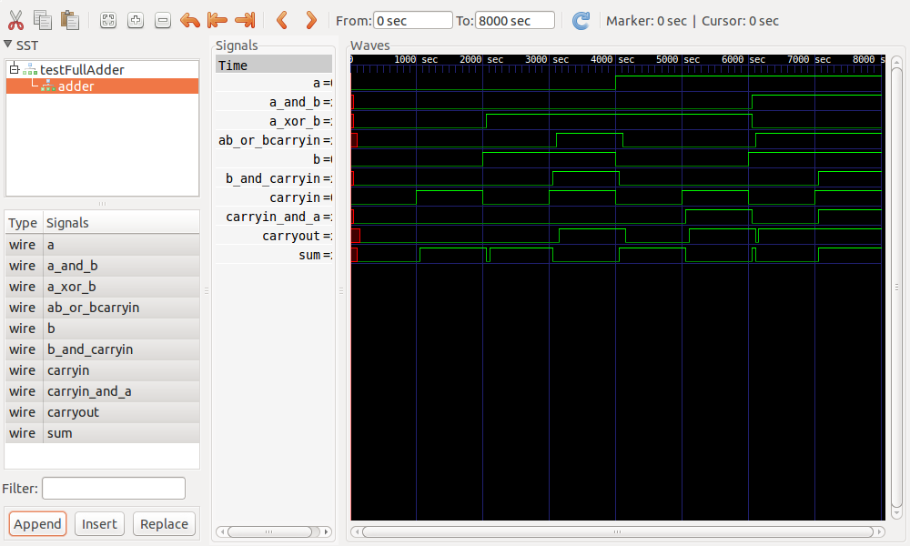
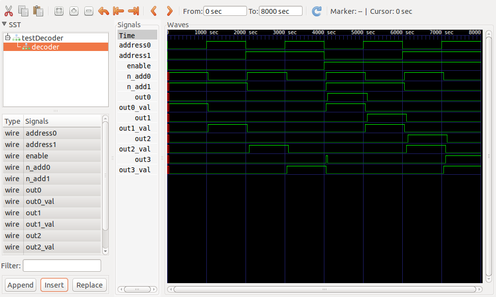
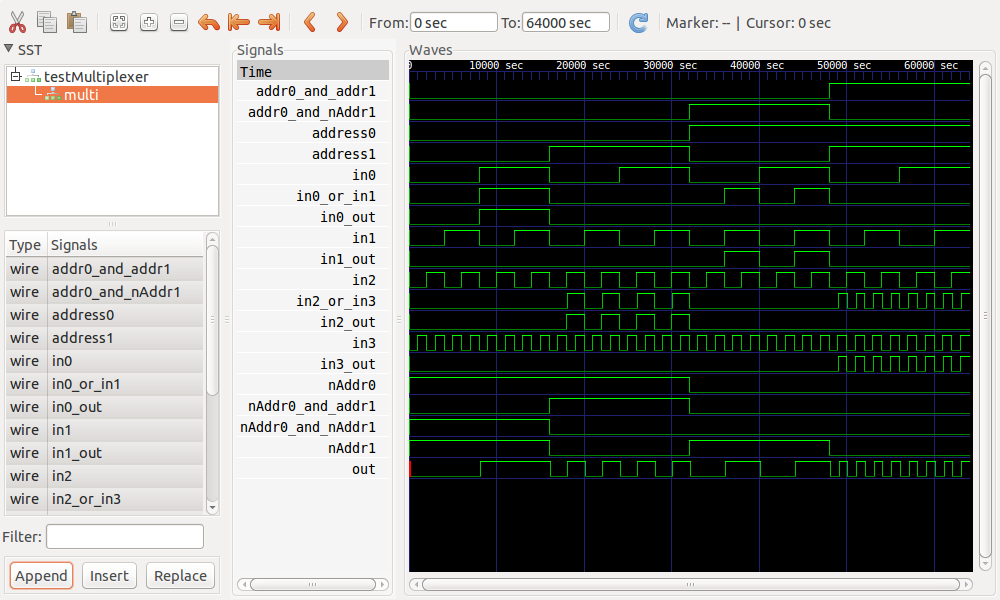

## Setup ##

1. Compile the verilog files with `make`
2. Run the test cases using `make test`
3. Waveforms can be inspected with `gtkwave some-file.vcd`

## Results ##

### Adder ###

| a | b | carryin | carryout | sum | Expected carryout | Expected sum |
|:-:|:-:|:-------:|:--------:|:---:|:-----------------:|:------------:|
| 0 | 0 |    0    |     0    |  0  |         0         |       0      |
| 0 | 0 |    1    |     0    |  1  |         0         |       1      |
| 0 | 1 |    0    |     0    |  1  |         0         |       1      |
| 0 | 1 |    1    |     1    |  0  |         1         |       0      |
| 1 | 0 |    0    |     0    |  1  |         0         |       1      |
| 1 | 0 |    1    |     1    |  0  |         1         |       0      |
| 1 | 1 |    0    |     1    |  0  |         1         |       0      |
| 1 | 1 |    1    |     1    |  1  |         1         |       1      |

### Decoder ###

| En | A0 | A1 | O0 | O1 | O2 | O3| Expected Output |
|:--:|:--:|:--:|:--:|:--:|:--:|:-:|:---------------:|
| 0  | 0  | 0  | 0  | 0  | 0  | 0 | All false       |
| 0  | 1  | 0  | 0  | 0  | 0  | 0 | All false       |
| 0  | 0  | 1  | 0  | 0  | 0  | 0 | All false       |
| 0  | 1  | 1  | 0  | 0  | 0  | 0 | All false       |
| 1  | 0  | 0  | 1  | 0  | 0  | 0 | O0 Only         |
| 1  | 1  | 0  | 0  | 1  | 0  | 0 | O1 Only         |
| 1  | 0  | 1  | 0  | 0  | 1  | 0 | O2 Only         |
| 1  | 1  | 1  | 0  | 0  | 0  | 1 | O3 Only         |

### Multiplexer ###

| address0 | address1 | in0 | in1 | in2 | in3 | out | Expected Output |
|:--------:|:--------:|:---:|:---:|:---:|:---:|:---:|:---------------:|
|    0     |    0     |  0  |  0  |  0  |  0  |  0  |         0       |
|    0     |    0     |  0  |  0  |  0  |  1  |  0  |         0       |
|    0     |    0     |  0  |  0  |  1  |  0  |  0  |         0       |
|    0     |    0     |  0  |  0  |  1  |  1  |  0  |         0       |
|    0     |    0     |  0  |  1  |  0  |  0  |  0  |         0       |
|    0     |    0     |  0  |  1  |  0  |  1  |  0  |         0       |
|    0     |    0     |  0  |  1  |  1  |  0  |  0  |         0       |
|    0     |    0     |  0  |  1  |  1  |  1  |  0  |         0       |
|    0     |    0     |  1  |  0  |  0  |  0  |  1  |         1       |
|    0     |    0     |  1  |  0  |  0  |  1  |  1  |         1       |
|    0     |    0     |  1  |  0  |  1  |  0  |  1  |         1       |
|    0     |    0     |  1  |  0  |  1  |  1  |  1  |         1       |
|    0     |    0     |  1  |  1  |  0  |  0  |  1  |         1       |
|    0     |    0     |  1  |  1  |  0  |  1  |  1  |         1       |
|    0     |    0     |  1  |  1  |  1  |  0  |  1  |         1       |
|    0     |    0     |  1  |  1  |  1  |  1  |  1  |         1       |
|    0     |    1     |  0  |  0  |  0  |  0  |  0  |         0       |
|    0     |    1     |  0  |  0  |  0  |  1  |  0  |         0       |
|    0     |    1     |  0  |  0  |  1  |  0  |  1  |         1       |
|    0     |    1     |  0  |  0  |  1  |  1  |  1  |         1       |
|    0     |    1     |  0  |  1  |  0  |  0  |  0  |         0       |
|    0     |    1     |  0  |  1  |  0  |  1  |  0  |         0       |
|    0     |    1     |  0  |  1  |  1  |  0  |  1  |         1       |
|    0     |    1     |  0  |  1  |  1  |  1  |  1  |         1       |
|    0     |    1     |  1  |  0  |  0  |  0  |  0  |         0       |
|    0     |    1     |  1  |  0  |  0  |  1  |  0  |         0       |
|    0     |    1     |  1  |  0  |  1  |  0  |  1  |         1       |
|    0     |    1     |  1  |  0  |  1  |  1  |  1  |         1       |
|    0     |    1     |  1  |  1  |  0  |  0  |  0  |         0       |
|    0     |    1     |  1  |  1  |  0  |  1  |  0  |         0       |
|    0     |    1     |  1  |  1  |  1  |  0  |  1  |         1       |
|    0     |    1     |  1  |  1  |  1  |  1  |  1  |         1       |
|    1     |    0     |  0  |  0  |  0  |  0  |  0  |         0       |
|    1     |    0     |  0  |  0  |  0  |  1  |  0  |         0       |
|    1     |    0     |  0  |  0  |  1  |  0  |  0  |         0       |
|    1     |    0     |  0  |  0  |  1  |  1  |  0  |         0       |
|    1     |    0     |  0  |  1  |  0  |  0  |  1  |         1       |
|    1     |    0     |  0  |  1  |  0  |  1  |  1  |         1       |
|    1     |    0     |  0  |  1  |  1  |  0  |  1  |         1       |
|    1     |    0     |  0  |  1  |  1  |  1  |  1  |         1       |
|    1     |    0     |  1  |  0  |  0  |  0  |  0  |         0       |
|    1     |    0     |  1  |  0  |  0  |  1  |  0  |         0       |
|    1     |    0     |  1  |  0  |  1  |  0  |  0  |         0       |
|    1     |    0     |  1  |  0  |  1  |  1  |  0  |         0       |
|    1     |    0     |  1  |  1  |  0  |  0  |  1  |         1       |
|    1     |    0     |  1  |  1  |  0  |  1  |  1  |         1       |
|    1     |    0     |  1  |  1  |  1  |  0  |  1  |         1       |
|    1     |    0     |  1  |  1  |  1  |  1  |  1  |         1       |
|    1     |    1     |  0  |  0  |  0  |  0  |  0  |         0       |
|    1     |    1     |  0  |  0  |  0  |  1  |  1  |         1       |
|    1     |    1     |  0  |  0  |  1  |  0  |  0  |         0       |
|    1     |    1     |  0  |  0  |  1  |  1  |  1  |         1       |
|    1     |    1     |  0  |  1  |  0  |  0  |  0  |         0       |
|    1     |    1     |  0  |  1  |  0  |  1  |  1  |         1       |
|    1     |    1     |  0  |  1  |  1  |  0  |  0  |         0       |
|    1     |    1     |  0  |  1  |  1  |  1  |  1  |         1       |
|    1     |    1     |  1  |  0  |  0  |  0  |  0  |         0       |
|    1     |    1     |  1  |  0  |  0  |  1  |  1  |         1       |
|    1     |    1     |  1  |  0  |  1  |  0  |  0  |         0       |
|    1     |    1     |  1  |  0  |  1  |  1  |  1  |         1       |
|    1     |    1     |  1  |  1  |  0  |  0  |  0  |         0       |
|    1     |    1     |  1  |  1  |  0  |  1  |  1  |         1       |
|    1     |    1     |  1  |  1  |  1  |  0  |  0  |         0       |
|    1     |    1     |  1  |  1  |  1  |  1  |  1  |         1       |

