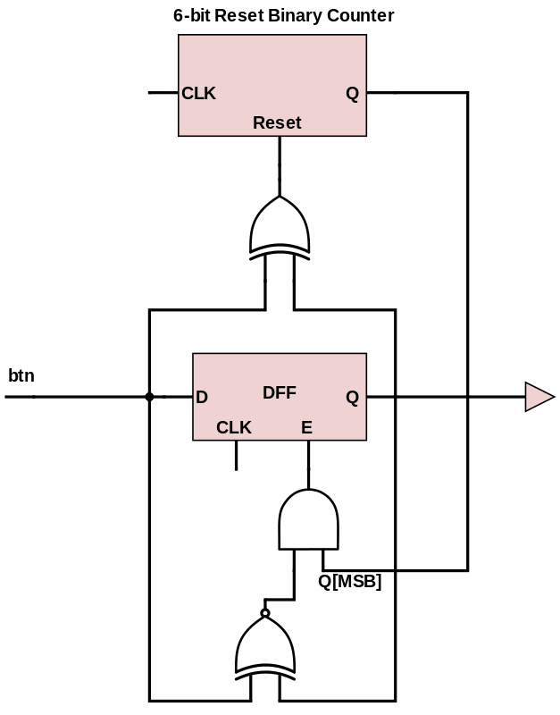
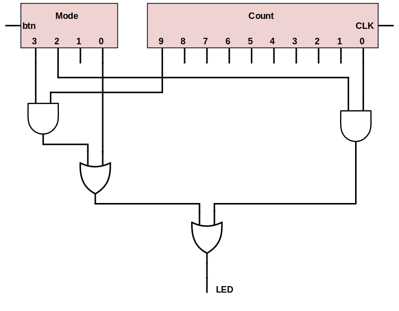
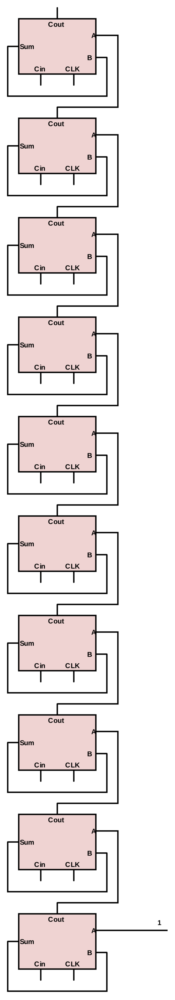
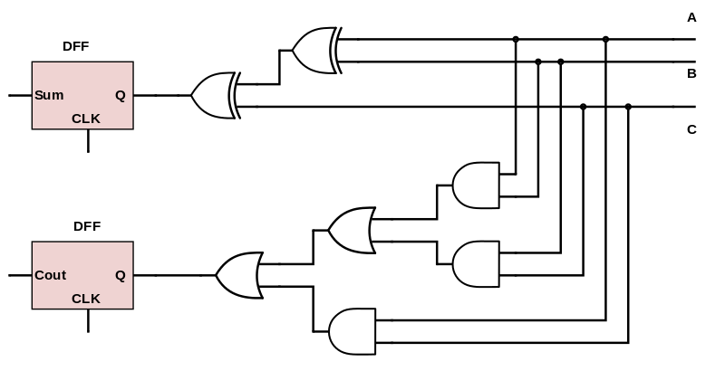

Schematic
=========

### Additional Components ###

#### Input Conditioner ####

##### Inputs #####

##### Outputs #####

##### Schematic #####

##### Size #####

TODO: calculate the size of the up counter

##### Sub-Components #####

- 6 Bit Reset Binary Counter
- DFF/E

#### Finite State Machine ####

##### Inputs #####

##### Outputs #####

##### Schematic #####

##### Size #####

TODO: calculate the size of the up counter

##### Sub-Components #####

- 4 Stage Ring Counter
- 10 Bit Binary Counter

#### 10 Bit Binary Counter ####

##### Inputs #####

##### Outputs #####

##### Schematic #####

##### Size #####

TODO: calculate the size of the up counter

##### Sub-Components #####

- 1 Bit Full Adder

#### 1 Bit Full Adder ####

##### Inputs #####

##### Outputs #####

##### Schematic #####

##### Size #####

TODO: calculate the size of the up counter

##### Sub-Components #####

- DFF

#### 6 Bit Reset Binary Counter ####

##### Inputs #####

##### Outputs #####

##### Schematic #####

##### Size #####

TODO: calculate the size of the up counter

##### Sub-Components ######

- 1 Bit Full Adder
