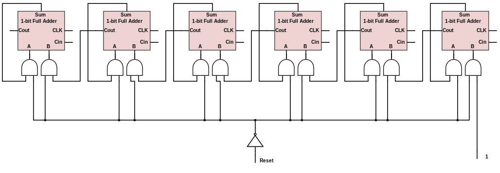
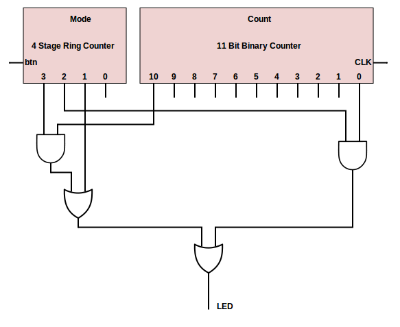
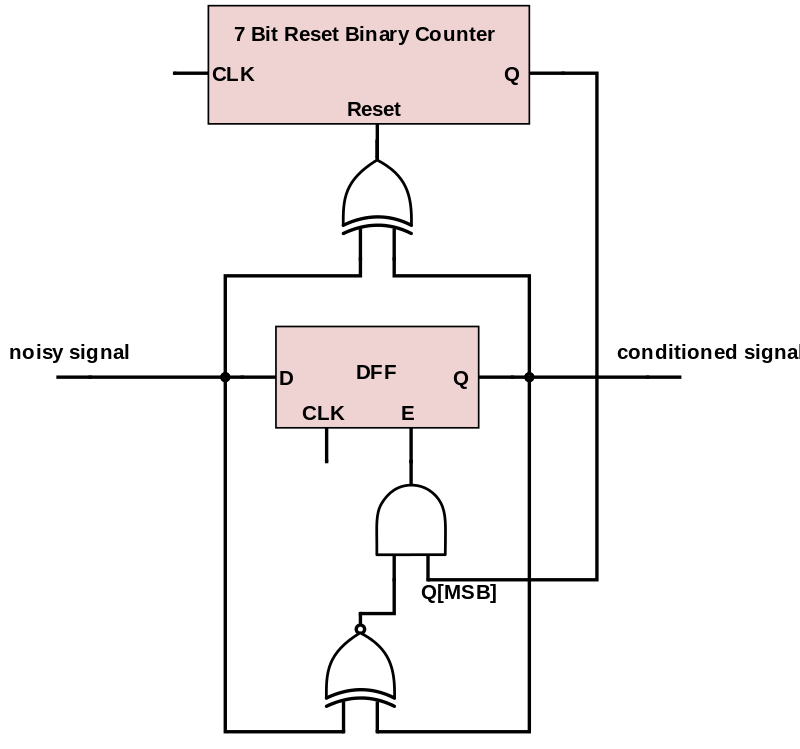

Schematic
=========

### Additional Components ###

#### 1 Bit Full Adder ####

##### Inputs #####

##### Outputs #####

##### Schematic #####

##### Size #####

TODO: calculate the size of the up counter

#### 10 Bit Full Adder ####

##### Inputs #####

##### Outputs #####

##### Schematic #####

##### Size #####

TODO: calculate the size of the up counter

#### 6 Bit Reset Binary Adder ####

##### Inputs #####

##### Outputs #####

##### Schematic #####

##### Size #####

TODO: calculate the size of the up counter

#### Finite State Machine ####

##### Inputs #####

##### Outputs #####

##### Schematic #####

##### Size #####

TODO: calculate the size of the up counter

#### Input Conditioner ####

##### Inputs #####

##### Outputs #####

##### Schematic #####

##### Size #####

TODO: calculate the size of the up counter
