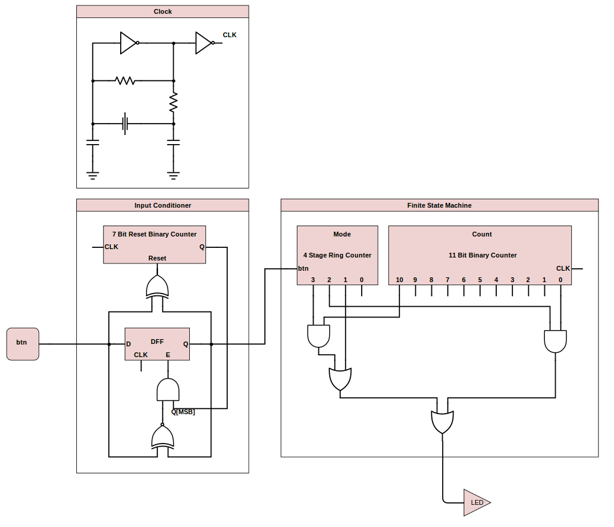

Schematic
=========

### Block Diagram ###

### Expanded Block Diagram ###

##### Inputs #####

The bike light control takes one input from the button.

##### Outputs #####

The system outputs the control value for the LED.

##### Size #####

This component uses the following components:
- A D Flip Flop with Enable
- A 7 Bit Reset Binary Counter (described below)
- An XOR gate
- An XNOR Gate
- An AND Gate

The total size can be found by taking the total size of each component:

| Component            | Number of Inputs | Quantity | Size Each | Component Total |
|:--------------------:|:----------------:|:--------:|:---------:|:---------------:|
| Clock                |        0         |    1     |    2      |       2         |
| Input Conditioner    |        1         |    1     |    386    |       386       |
| Finite State Machine |        2         |    1     |    590    |       590       |
| Grand Total          |                  |          |           |       978       |

### Additional Components ###

#### Input Conditioner ####

This component will be used to debounce the readings taken from the button. In order to prevent double presses, the input conditioner must read a stable value for at least 1.9 milliseconds. 

##### Inputs #####

The input conditioner takes two inputs. These include a noisy signal and the clock. 

##### Outputs #####

After the specified stabilization period, this component will output the conditioned signal.

##### Schematic #####

##### Size #####

This component uses the following components:
- A D Flip Flop with Enable
- A 7 Bit Reset Binary Counter (described below)
- An XOR gate
- An XNOR Gate
- An AND Gate

The total size can be found by taking the total size of each component:

| Component                  | Number of Inputs | Quantity | Size Each | Component Total |
|:--------------------------:|:----------------:|:--------:|:---------:|:---------------:|
| D Flip Flop with Enable    |        4         |    1     |    20     |       20        |
| 7 Bit Reset Binary Counter |        2         |    1     |    358    |       358       |
| XOR Gate                   |        2         |    1     |    3      |       3         |
| XNOR Gate                  |        2         |    1     |    2      |       2         |
| AND Gate                   |        2         |    1     |    3      |       3         |
| Grand Total                |                  |          |           |       386       |

#### Finite State Machine ####

The finite state machine is the control unit of the system. It keeps track of the current mode and the number of clock cycles that have passed in order to send the proper control signals to the LED at its output.

##### Inputs #####

The Finite State Machine takes in two inputs. These include the clock and a signal, that when high, will increment the current mode.

##### Outputs #####

This component outputs the signal controlling whether or not the LED should illuminate or remain off.

##### Schematic #####

##### Size #####

This component uses the following components:
- A 4 Stage Ring Counter
- A 11 Bit Binary Counter (described below)
- 2 OR Gates
- 2 AND Gates

The total size can be found by taking the total size of each component:

| Component             | Number of Inputs | Quantity | Size Each | Component Total |
|:---------------------:|:----------------:|:--------:|:---------:|:---------------:|
| 4 Stage Ring Counter  |        2         |    1     |    83     |       83        |
| 11 Bit Binary Counter |        1         |    1     |    495    |       495       |
| OR Gate               |        2         |    2     |    3      |       6         |
| AND Gate              |        2         |    2     |    3      |       6         |
| Grand Total           |                  |          |           |       590       |

#### N Bit Binary Counter ####

The N Bit Binary Counter is able to count up to large numbers. By incrementing the counter at every clock cycle, we can use it to control the blinking of the LED.

##### Inputs #####

The N Bit Binary Counter only takes the clock as input.

##### Outputs #####

The component outputs a binary number of width N, representing the current value of the count.

##### Schematic #####

##### Size #####

This component uses the following components:
- N One Bit Full Adders (described below)

The total size can be found by taking the total size of each component:

| Component        | Number of Inputs | Quantity | Size Each | Component Total |
|:----------------:|:----------------:|:--------:|:---------:|:---------------:|
| 1 Bit Full Adder |        4         |    N     |    45     |       45N       |
| Grand Total      |                  |          |           |       45N       |

#### 1 Bit Full Adder ####

The 1 Bit Full Adder is used to compute the sum of two bits and a carryin. The component is clocked and outputs the sum of the inputs along with a carrout on the rising edge of the clock. This component can be used again and again to compose larger adders.

##### Inputs #####

The Adder takes four inputs. These include a one bit operand A, a one bit operand B, a one bit carryin, and the clock.

##### Outputs #####

The component outputs a one bit sum and a one bit carry out.

##### Schematic #####

##### Size #####

This component uses the following components:
- 2 D Flip Flops
- 2 XNOR Gates
- 3 AND Gates
- 2 OR Gates

The total size can be found by taking the total size of each component:

| Component   | Number of Inputs | Quantity | Size Each | Component Total |
|:-----------:|:----------------:|:--------:|:---------:|:---------------:|
| D Flip Flop |        2         |     2    |    13     |       26        |
| XNOR Gate   |        2         |     2    |    2      |       4         |
| AND Gate    |        2         |     3    |    3      |       9         |
| OR Gate     |        2         |     2    |    3      |       6         |
| Grand Total |                  |          |           |       45        |

#### N Bit Reset Binary Counter ####

This is a clocked component able to count up to (2^N)-1. It is also resetable by sending a high signal to the reset pin. 

##### Inputs #####

This component takes the clock as input and a reset signal, which causes the counter to reset to 0 when high.

##### Outputs #####

The counter outputs a binary number of width N, indicating the current count.

##### Schematic #####

##### Size #####

This component uses the following components:
- N One Bit Full Adders
- 2N AND Gates
- 1 NOT Gate

The total size can be found by taking the total size of each component:

| Component          | Number of Inputs | Quantity | Size Each | Component Total |
|:------------------:|:----------------:|:--------:|:---------:|:---------------:|
| One Bit Full Adder |        4         |     N    |    45     |       45N       |
| AND Gate           |        2         |     2N   |    3      |       6N        |
| NOT Gate           |        1         |     1    |    1      |       1         |
| Grand Total        |                  |          |           |       51N+1     |

