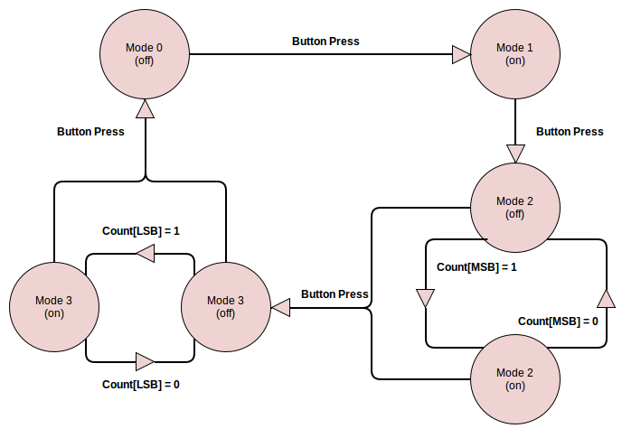

Specification Document
======================

This document serves to specify the behavior of a bike light LED controller.

### I/O ###

This device takes one input and sends one output. The controller receives data in the form of a push button. The output of the controller illiminates an LED.

### Operational Modes ###

The device has four operational modes. These include "Off", "On", "Blinking", and "Dim". Each time the input button is pressed, the device will operate in the next mode. Once the device has reached the last mode, it will then cycle back to the first mode the next time the button is pressed. These modes can be visualized with the following figures.

#### Off ####

#### On ####

#### Blinking ####

#### Dim ####

TODO: Put images of each mode here

#### Finite State Machine ####

This finite state machine describes the states in which the controller can operate and the signals that cause a change of state.

### Measurements ###

TODO: Think of measurements to put here
- blinking frequency
- input conditioner timing
